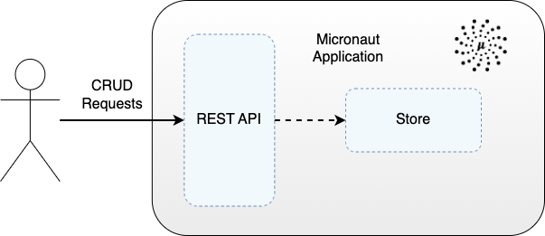

# Micronaut & Kotlin Demo with a REST API

Demo Micronaut application written in Kotlin exposing a REST API to enable performing of CRUD operations on an entity.  The application stores entities in memory.

<div style="text-align:center"></div>
<p style="text-align: center;"><I>Figure 1: Micronaut application with REST API</I></p>

Demonstrates using both a standard JVM-based application and a native image using GraalVM.  GraalVM compiles the Java application ahead of time into a platform-specific native binary executable. This native executable does not require a Java runtime environment to execute. Instead, it can be executed directly on the target platform.  This can lead to faster startup times and reduced memory footprint compared to running on the JVM.

The companion project, with the application written in Java instead of Kotlin, is available here:
https://github.com/lydtechconsulting/micronaut-rest-java

## Running The Demo

The project requires Java 21 to build.

Build and test the Micronaut application, and then run:
```
./gradlew clean test
./gradlew run
```

Alternatively, following tests, build a native executable with GraalVM (version 21) - [install instructions](https://www.graalvm.org/latest/docs/getting-started/) - and then run:
```
./gradlew clean test
./gradlew nativeCompile
./gradlew nativeRun
```
The standard `test` task is used as the unit tests using mocks, and these are not straightforward to use via the `nativeTest` task.  Mocks typically rely on runtime features such as reflection which are not fully supported with Kotlin/Native.

In a terminal window use curl to submit a POST REST request to the application to create an item:
```
curl -i -X POST localhost:9001/v1/items -H "Content-Type: application/json" -d '{"name": "test-item"}'
```

A response should be returned with the 201 CREATED status code and the new item id in the Location header:
```
HTTP/1.1 201 
Location: 653d06f08faa89580090466e
```

The Micronaut application should log the successful item persistence:
```
Item created with id: 653d06f08faa89580090466e
```

Get the item that has been created using curl:
```
curl -i -X GET localhost:9001/v1/items/653d06f08faa89580090466e
```

A response should be returned with the 200 SUCCESS status code and the item in the response body:
```
HTTP/1.1 200 
Content-Type: application/json

{"id":"653d06f08faa89580090466e","name":"test-item"}
```

In a terminal window use curl to submit a PUT REST request to the application to update the item:
```
curl -i -X PUT localhost:9001/v1/items/653d06f08faa89580090466e -H "Content-Type: application/json" -d '{"name": "test-item-update"}'
```

A response should be returned with the 204 NO CONTENT status code:
```
HTTP/1.1 204 
```

The Micronaut application should log the successful update of the item:
```
Item updated with id: 653d06f08faa89580090466e - name: test-item-update
```

Delete the item using curl:
```
curl -i -X DELETE localhost:9001/v1/items/653d06f08faa89580090466e
```

The Micronaut application should log the successful deletion of the item:
```
Deleted item with id: 653d06f08faa89580090466e
```

## Component Tests

The component tests bring up the application in a docker container and hit this via the REST API to create, retrieve, update, and delete an item.

For more on the component tests see: https://github.com/lydtechconsulting/component-test-framework

Build the Micronaut application jar, followed by the Docker container:
```
./gradlew clean build
docker build -t ct/micronaut-rest-kotlin:latest .
```

Alternatively, build a native executable with GraalVM, followed by the Docker container:
```
./gradlew clean nativeCompile
./gradlew dockerBuildNative
```

Run component tests:
```
./gradlew componentTest --rerun-tasks
```

Run tests leaving containers up:
```
./gradlew componentTest --rerun-tasks -Dcontainers.stayup=true
```

Note that `--rerun-tasks` is required for subsequent runs when no change has happened between test runs.

## Docker Clean Up

Manual clean up (if left containers up):
```
docker rm -f $(docker ps -aq)
```
